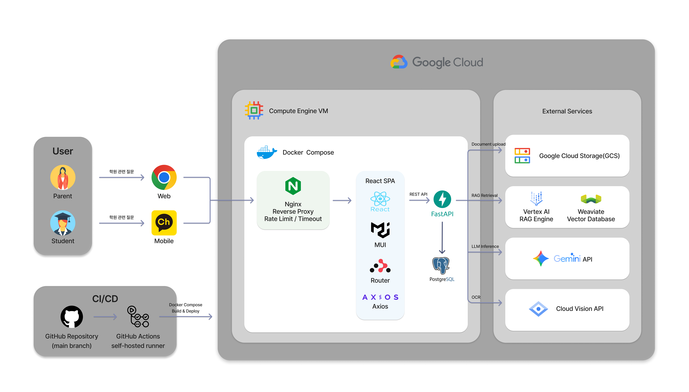
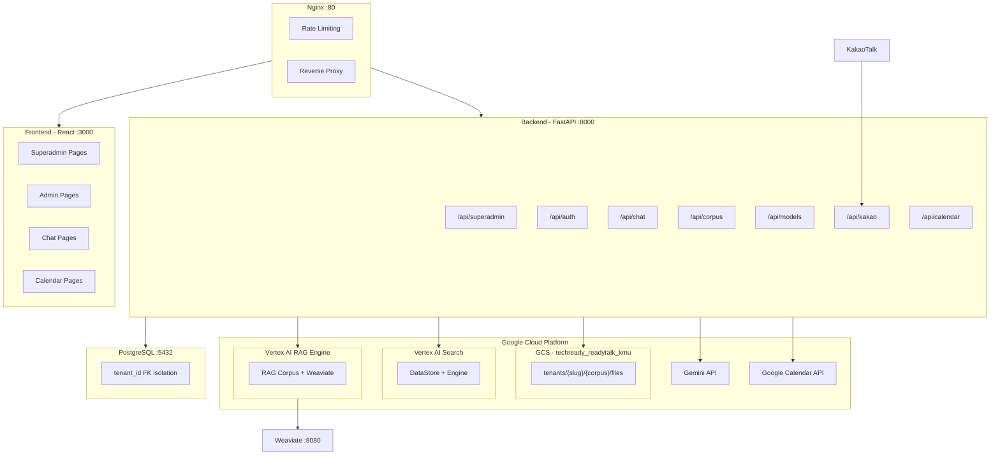
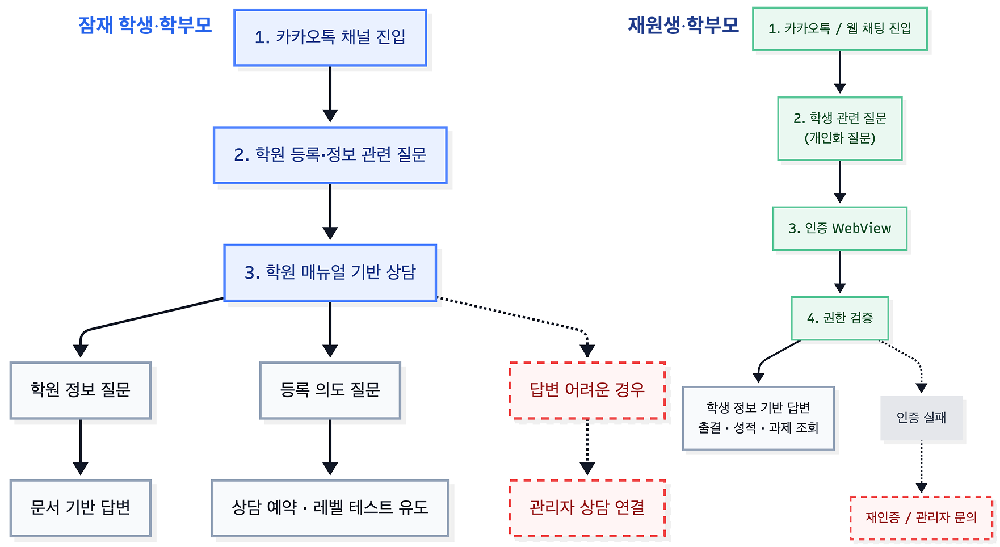
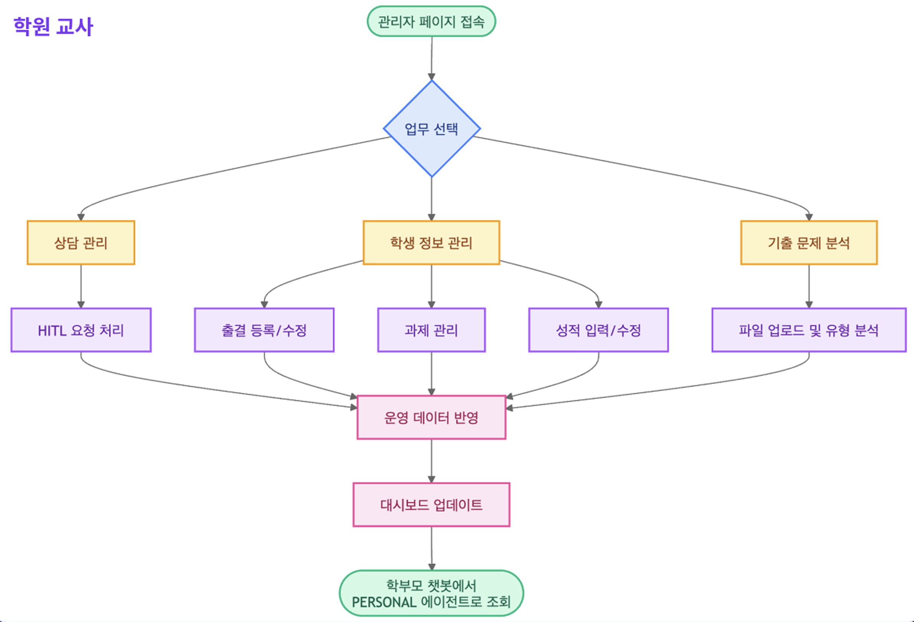

# 🎓 산학 캡스톤 22조 : ReadyTalk for Academy

**※ 본 프로젝트는 산학협력으로 진행되어 기업과의 협약에 따라 현재 레포지토리 및 소스 코드는 외부에 공개하기 어려운 점 양해 부탁드립니다.**

🔗 **[서비스 바로가기](https://academy.ready.talk/kookmin-language-institute/login)**
<sub>로그인이 필요합니다.</sub>


## 서비스 소개
**ReadyTalk for Academy**는 학원 운영을 효율화하고 사용자 맞춤형 상담을 제공하기 위한 AI 기반 멀티 에이전트 챗봇입니다.  
비인증 사용자에게는 학원 매뉴얼 기반 상담과 행동 유도를 제공하고, 인증된 사용자에게는 출결 관리, 수업 일정, 과제 현황 등 개인화된 서비스를 제공합니다. 또한, 인증된 사용자는 AI 분류된 유형별 문제를 제공받을 수 있습니다.  
학원 관리자에게는 직관적인 인터페이스를 통한 학생 관리와 AI를 기출 문제 유형 자동 분류를 통해 문제 분석에 소요되는 업무 시간을 단축해 드립니다.

## 소개 영상
[▶ ReadyTalk KMU 소개 영상 보기](https://drive.google.com/file/d/18CfrjWVct1oWHmwp9qi_mw5pkovg0pPO/view?usp=sharing)

  

## 팀 소개  

<table>
  <tr>
    <td align="center" width="160">
      <a href="https://github.com/yangjiwoong1">
        <br />
        <b>양지웅</b>
      </a><br />
      <sub>팀장 · Backend</sub>
    </td>
    <td align="center" width="160">
      <a href="https://github.com/ume24">
        <br />
        <b>정유미</b>
      </a><br />
      <sub>AI Agent · Frontend</sub>
    </td>
    <td align="center" width="160">
      <a href="https://github.com/yunseo1011">
        <br />
        <b>이윤서</b>
      </a><br />
      <sub>AI Agent · Frontend</sub>
    </td>
    <td align="center" width="160">
      <a href="https://github.com/seungil0909">
        <br />
        <b>양승일</b>
      </a><br />
      <sub>문서 정리 · 데이터셋</sub>
    </td>
    <td align="center" width="160">
      <a href="https://github.com/hyeforest7">
        <br />
        <b>유혜성</b>
      </a><br />
      <sub>QA · Frontend 보조</sub>
    </td>
  </tr>
</table>

---

## Architecture Overview





## AI 문제 은행 구조


## User Flow





## Tech Stack

| Layer     | Technology                                           |
| --------- | ---------------------------------------------------- |
| Frontend  |    Axios             |
| Backend   |   Alembic  + Uvicorn  |
| Database  | 15                                        |
| AI/Search | Vertex AI RAG Engine · Vertex AI Search ·  |
| Vector DB | Weaviate (RAG Engine 백엔드)                         |
| Storage   |                                  |
| Infra     |   GCP Compute Engine          |
| Auth      |  (python-jose)                                    |
| Messaging |  Open Builder                               |

## 검색 엔진 이중 지원

테넌트별로 검색 엔진을 선택할 수 있습니다:

| 엔진                  | 서비스              | 리소스 구조           | 용도                     |
| --------------------- | ------------------- | --------------------- | ------------------------ |
| **RAG Engine** (기본) | `rag_service.py`    | ragCorpora → ragFiles | Weaviate 하이브리드 검색 |
| **Vertex AI Search**  | `search_service.py` | dataStores → engines  | Google 관리형 검색       |

```python
# tenant.search_backend 필드로 선택
"rag_engine"       # Vertex AI RAG + Weaviate
"vertex_ai_search" # Vertex AI Search (DataStore + Engine)
```

## Multi-Tenant Architecture

### 테넌트 격리 방식

모든 테이블에 `tenant_id` FK를 부여하여 데이터베이스 레벨에서 격리합니다.

```
tenants
  ├── users (tenant_id FK)
  ├── groups (tenant_id FK)
  ├── corpora (tenant_id FK)
  │     └── documents (tenant_id FK)
  ├── chat_sessions (tenant_id FK)
  │     └── messages (tenant_id FK)
  ├── tenant_gcp_configs (1:1)
  ├── tenant_kakao_configs (1:1)
  ├── tenant_calendar_configs (1:1)
  └── chatbot_settings (1:1)
```

### GCP 리소스 구조

**1 GCP 프로젝트, 1 GCS 버킷, N 테넌트** 구조:

```
GCP Project: techready-readytalk-kmu
│
├── Vertex AI RAG (asia-northeast3)
│   ├── ragCorpora/xxx  ← 테넌트A (RAG Engine)
│   └── ragCorpora/yyy  ← 테넌트B (RAG Engine)
│
├── Vertex AI Search (global)
│   ├── dataStores/aaa + engines/aaa  ← 테넌트C (Vertex AI Search)
│   └── dataStores/bbb + engines/bbb  ← 테넌트D (Vertex AI Search)
│
├── Weaviate (Docker, weaviate-kmu.ready.talk)
│   └── Collection per RAG Corpus
│
└── GCS Bucket: techready_readytalk_kmu
    └── tenants/
        ├── tenant-a/
        │   └── corpus-name/
        │       └── files...
        └── tenant-b/
            └── corpus-name/
                └── files...
```

## User Hierarchy

```
Superadmin (tenant_id=NULL, is_superadmin=True)
│  플랫폼 전체 관리: 테넌트 CRUD, GCP 설정, 기본 모델 설정
│
├── Tenant Admin (is_admin=True)
│   │  테넌트 내 관리: 문서저장소, 문서 업로드/삭제, 학생 관리, 사용자 관리, 문제 유형 분류
│   │
│   │
│   └── Guest User (auth_provider=guest)
│         채팅만 가능, 파일 업로드 불가
│
└── KakaoTalk User (auth_provider=kakao)
      카카오톡 채널 통해 자동 생성, 채팅만 가능
```

## Chat Flow (Function Calling 기반)

```
사용자 질문
    │
    ▼
모델 결정 (user.preferred_model > DEFAULT_MODEL)
    │
    ▼
query_smart() — Gemini Function Calling
    │
    ├── search_documents() → RAG Corpus 검색 (top_k=5)
    ├── search_web()       → Google Search (web_search_enabled 시)
    ├── list/create/update/delete_calendar_events() → Google Calendar
    └── (none)             → 일반 대화
    │
    ▼
응답 생성 + 출처 추출
    │  - cited_sources에서 파일명 추출
    │  - DB에서 display_name 조회 (UUID→원본명)
    │  - GCS Signed URL 생성 (출처 링크)
    │
    ▼
DB 저장 (messages 테이블) → 응답 반환
```

## KakaoTalk Integration

```
카카오톡 사용자 → 카카오 서버 → /api/kakao/skill (webhook)
                                    │
                                    ├── 사용자 자동 생성/조회
                                    ├── Function Calling 기반 스마트 쿼리
                                    ├── 응답 분할 (1000자 × 최대 3개 말풍선)
                                    └── Callback URL로 비동기 응답
```

## Superadmin 관리

### Platform Settings

| 키                         | 설명                       |
| -------------------------- | -------------------------- |
| `VERTEX_AI_PROJECT_ID`     | GCP 프로젝트 ID            |
| `VERTEX_AI_LOCATION`       | Vertex AI 리전             |
| `GCP_CREDENTIALS_PATH`     | 서비스 계정 JSON 경로      |
| `GCS_BUCKET_NAME`          | GCS 버킷명                 |
| `GEMINI_API_KEY`           | Gemini API 키              |
| `DEFAULT_MODEL`            | 기본 AI 모델               |
| `WEAVIATE_HTTP_ENDPOINT`   | Weaviate 엔드포인트        |
| `WEAVIATE_COLLECTION_NAME` | Weaviate 컬렉션명          |
| `WEAVIATE_API_KEY_SECRET`  | Secret Manager 시크릿 경로 |

### Tenant Lifecycle

**생성 시 자동 프로비저닝:**
1. Tenant 레코드 생성 (name, slug, search_backend)
2. GCP Config 생성 (공용 프로젝트/버킷 연결)
3. 기본 그룹 생성 (관리자, 일반)
4. 관리자 계정 자동 생성
5. GCS에 테넌트 폴더 생성

**삭제 시 Cascade Cleanup:**
1. Vertex AI RAG Corpus 또는 Search DataStore/Engine 삭제
2. GCS 테넌트 폴더 및 하위 파일 삭제
3. DB Cascade 삭제

## Project Structure

```
2026-capstone-22/
├── backend/
│   ├── app/
│   │   ├── main.py
│   │   ├── config.py
│   │   ├── database.py
│   │   ├── llm_tools/
│   │   │   ├── assignment.py          # 과제 관련 LLM 도구
│   │   │   ├── attendance.py          # 출결 관련 LLM 도구
│   │   │   ├── exam.py                # 시험 관련 LLM 도구
│   │   │   ├── question_bank.py       # 문제 은행 LLM 도구
│   │   │   └── student.py             # 학생 관련 LLM 도구
│   │   ├── models/
│   │   │   ├── tenant.py              # Tenant, GcpConfig, KakaoConfig, CalendarConfig
│   │   │   ├── user.py
│   │   │   ├── group.py
│   │   │   ├── student.py             # 학생 정보
│   │   │   ├── attendance.py          # 출결
│   │   │   ├── assignment.py          # 과제
│   │   │   ├── exam.py                # 시험
│   │   │   ├── exam_paper.py          # 시험지
│   │   │   ├── chat.py
│   │   │   ├── corpus.py
│   │   │   ├── chatbot_settings.py
│   │   │   ├── prompt_template.py
│   │   │   ├── platform_setting.py
│   │   │   ├── hitl_request.py        # Human-in-the-loop 요청
│   │   │   ├── student_access_link.py
│   │   │   ├── usage.py
│   │   │   ├── verification_challenge.py
│   │   │   └── store_permission.py
│   │   ├── routers/
│   │   │   ├── superadmin.py          # 플랫폼 관리
│   │   │   ├── auth.py                # 로그인, 회원가입, JWT
│   │   │   ├── chat.py                # 스마트 쿼리 (Function Calling)
│   │   │   ├── corpus.py              # 문서저장소 CRUD
│   │   │   ├── calendar.py            # Google Calendar OAuth
│   │   │   ├── kakao.py               # 카카오톡 webhook
│   │   │   ├── chatbot_settings.py    # 챗봇 설정
│   │   │   ├── prompt_templates.py    # 프롬프트 템플릿
│   │   │   ├── models.py              # Gemini 모델 목록
│   │   │   ├── admin.py               # 테넌트 어드민
│   │   │   ├── students.py            # 학생 관리
│   │   │   ├── attendance.py          # 출결 관리
│   │   │   ├── assignments.py         # 과제 관리
│   │   │   ├── exams.py               # 시험 관리
│   │   │   ├── question_bank.py       # 문제 은행
│   │   │   ├── hitl.py                # Human-in-the-loop
│   │   │   ├── tenants.py
│   │   │   └── verification.py        # 학생 본인 인증
│   │   ├── services/
│   │   │   ├── rag_service.py         # Vertex AI RAG + Weaviate
│   │   │   ├── search_service.py      # Vertex AI Search
│   │   │   ├── chat_service.py        # 스마트 쿼리 엔진
│   │   │   ├── gemini_client.py       # Gemini API 클라이언트
│   │   │   ├── gcs_service.py         # GCS 파일 관리
│   │   │   ├── calendar_service.py    # Google Calendar 연동
│   │   │   ├── ocr_service.py         # OCR (시험지 처리)
│   │   │   ├── question_bank_service.py
│   │   │   ├── question_preview_service.py
│   │   │   ├── question_split_service.py
│   │   │   ├── text_cleaning_service.py
│   │   │   ├── text_extraction_service.py
│   │   │   ├── attendance_queries.py
│   │   │   ├── assignment_queries.py
│   │   │   ├── exam_queries.py
│   │   │   ├── policy_service.py
│   │   │   ├── verification_service.py
│   │   │   ├── tenant_provisioning.py # 테넌트 프로비저닝
│   │   │   └── usage_service.py       # 사용량 추적
│   │   ├── schemas/
│   │   └── utils/
│   │       ├── dependencies.py        # 인증 미들웨어
│   │       ├── security.py            # JWT, 비밀번호 해싱
│   │       ├── init_data.py           # 초기 데이터 (superadmin)
│   │       ├── store_access.py        # 문서저장소 접근 권한
│   │       ├── chat_history.py
│   │       ├── email.py
│   │       ├── external_auth.py
│   │       ├── pii_filter.py
│   │       ├── pricing.py
│   │       └── retry.py
│   ├── credentials/                   # GCP 서비스 계정 JSON (gitignore)
│   ├── migrations/                    # Alembic DB 마이그레이션
│   ├── alembic.ini
│   ├── Dockerfile
│   └── Dockerfile.batch
├── frontend/
│   ├── src/
│   │   ├── App.js                     # 라우팅 (slug 기반 테넌트 분기)
│   │   ├── pages/
│   │   │   ├── ChatPage.js            # 채팅 UI
│   │   │   ├── AdminPage.js           # 테넌트 어드민
│   │   │   ├── CalendarPage.js        # 캘린더 UI
│   │   │   ├── AttendanceTab.js       # 출결 탭
│   │   │   ├── AssignmentTab.js       # 과제 탭
│   │   │   ├── ExamTab.js             # 시험 탭
│   │   │   ├── ExamAnalysisPage.js    # 시험 분석 (문제 은행)
│   │   │   ├── TenantAdminLayout.js
│   │   │   ├── VerifyPage.js          # 학생 본인 인증
│   │   │   └── superadmin/            # 슈퍼어드민 페이지들
│   │   ├── components/
│   │   │   ├── Auth/                  # 로그인, 회원가입
│   │   │   └── superadmin/
│   │   ├── services/api.js            # Axios API 클라이언트
│   │   └── context/
│   │       ├── AuthContext.js
│   │       ├── TenantContext.js
│   │       └── UploadContext.js
│   ├── public/
│   ├── Dockerfile
│   └── Dockerfile.prod
├── nginx/
│   └── backend.conf                   # Nginx 설정
├── imgs/                              # README 이미지
├── assets/                            # GitHub Pages 이미지
├── docker-compose.yml                 # 로컬 개발용
├── docker-compose.dev.yml             # 개발계 (GCP VM)
├── docker-compose.prod.yml            # 운영계
├── chatbot.service                    # systemd 서비스 파일
├── .env                               # 로컬 환경변수 (gitignore)
└── .env.production                    # 운영 환경변수 (gitignore)
```

## Getting Started

### Prerequisites

- Docker & Docker Compose
- GCP 서비스 계정 (Vertex AI + GCS + Secret Manager 권한)
- (선택) Google Calendar OAuth 클라이언트
- (선택) 카카오톡 오픈빌더 계정

### 1. 환경 설정

```bash
cp .env.example .env
# .env 파일 편집
```

### 2. GCP 서비스 계정

```bash
mkdir -p backend/credentials
cp your-service-account.json backend/credentials/readytalk-kmu-credentials.json
```

### 3. 실행

```bash
docker-compose up -d --build
```

### 4. 접속

| URL                                | 설명            |
| ---------------------------------- | --------------- |
| http://localhost:8888              | 메인            |
| http://localhost:8888/superadmin   | 슈퍼어드민      |
| http://localhost:8888/{slug}/chat  | 테넌트별 채팅   |
| http://localhost:8888/{slug}/admin | 테넌트별 어드민 |

### 5. 초기 설정 순서

1. 슈퍼어드민 로그인 (`admin@academy.ready.talk`)
2. 설정 > GCP 설정 입력
3. 설정 > 기본 모델 선택
4. 테넌트 생성 (검색 엔진 선택: RAG Engine 또는 Vertex AI Search)
5. 테넌트 어드민 → 문서저장소 생성 → 파일 업로드

---

📄 [최종발표 PPT](https://drive.google.com/file/d/10IoydXdpVATsOhA0DWK2qrbZhtkCjW5e/view?usp=drive_link)
