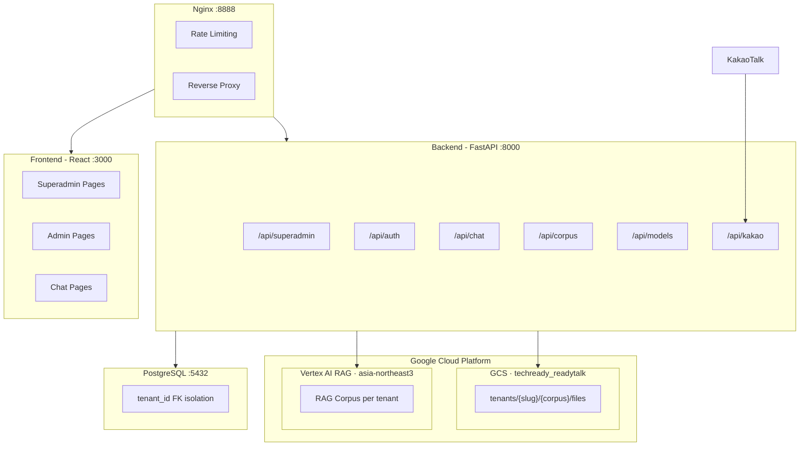

# ReadyTalk

Vertex AI RAG 기반 멀티테넌트 AI 챗봇 플랫폼

## Architecture Overview



## Tech Stack

| Layer | Technology |
|-------|-----------|
| Frontend | React 18 · MUI · React Router v6 · Axios |
| Backend | FastAPI · SQLAlchemy · Alembic · Gunicorn + Uvicorn |
| Database | PostgreSQL 15 |
| AI | Vertex AI RAG · Gemini API |
| Storage | Google Cloud Storage |
| Infra | Docker Compose · Nginx |
| Auth | JWT (python-jose) |
| Messaging | KakaoTalk Open Builder |

## Multi-Tenant Architecture

### 테넌트 격리 방식

모든 테이블에 `tenant_id` FK를 부여하여 데이터베이스 레벨에서 격리합니다.

```
tenants
  ├── users (tenant_id FK)
  ├── groups (tenant_id FK)
  ├── corpora (tenant_id FK)
  │     └── documents (tenant_id FK)
  ├── chat_sessions (tenant_id FK)
  │     └── messages (tenant_id FK)
  ├── tenant_gcp_configs (1:1)
  └── tenant_kakao_configs (1:1)
```

### GCP 리소스 구조

**1 GCP 프로젝트, 1 GCS 버킷, N 테넌트** 구조:

```
GCP Project: readytalk
│
├── Vertex AI RAG (asia-northeast3)
│   ├── ragCorpora/xxx  ← 테넌트A의 문서저장소1
│   ├── ragCorpora/yyy  ← 테넌트A의 문서저장소2
│   └── ragCorpora/zzz  ← 테넌트B의 문서저장소1
│
└── GCS Bucket: techready_readytalk
    └── tenants/
        ├── readytalk/          ← 테넌트 slug
        │   ├── corpus-name-1/
        │   │   ├── file1.pdf
        │   │   └── file2.docx
        │   └── corpus-name-2/
        │       └── file3.pdf
        └── other-tenant/
            └── corpus-name/
                └── file4.pdf
```

- **Vertex AI RAG**: 문서 임베딩 + 시맨틱 검색 (쿼리 시 사용)
- **GCS**: 원본 파일 저장 + Signed URL 다운로드 (출처 링크용)
- **서비스 계정**: 공용 1개 (모든 테넌트 공유)

## User Hierarchy

```
Superadmin (tenant_id=NULL, is_superadmin=True)
│  플랫폼 전체 관리: 테넌트 CRUD, GCP 설정, 기본 모델 설정
│
├── Tenant Admin (is_admin=True)
│   │  테넌트 내 관리: 문서저장소, 문서 업로드/삭제, 사용자 관리
│   │
│   ├── Regular User (그룹: 간사/일반)
│   │     채팅, 파일 업로드, 세션 관리
│   │
│   └── Guest User (auth_provider=guest)
│         채팅만 가능, 파일 업로드 불가
│
└── KakaoTalk User (auth_provider=kakao)
      카카오톡 채널 통해 자동 생성, 채팅만 가능
```

## Superadmin 관리 기능

### Platform Settings

슈퍼어드민 > 설정에서 관리하는 플랫폼 공통 설정:

| 키 | 설명 | 예시 |
|----|------|------|
| `VERTEX_AI_PROJECT_ID` | GCP 프로젝트 ID | `readytalk` |
| `VERTEX_AI_LOCATION` | Vertex AI 리전 | `asia-northeast3` |
| `GCP_CREDENTIALS_PATH` | 서비스 계정 JSON 경로 | `/app/credentials/sa.json` |
| `GCS_BUCKET_NAME` | 공용 GCS 버킷명 | `techready_readytalk` |
| `GEMINI_API_KEY` | Gemini API 키 (모델 목록 조회용) | `AIza...` |
| `DEFAULT_MODEL` | 기본 AI 모델 | `gemini-2.5-flash` |

설정 우선순위: **DB (platform_settings)** > 환경변수(.env) > 기본값

### Tenant Lifecycle

**생성 시 자동 프로비저닝:**
1. Tenant 레코드 생성 (name, slug, status)
2. GCP Config 생성 (공용 프로젝트/버킷 연결)
3. 기본 그룹 생성 (간사, 일반)
4. 관리자 계정 자동 생성 (`admin@readytalk-{slug}.com`)
5. GCS에 테넌트 폴더 생성 (`tenants/{slug}/.keep`)

**삭제 시 Cascade Cleanup:**
1. Vertex AI RAG Corpus 전체 삭제
2. GCS 테넌트 폴더 및 하위 파일 전체 삭제
3. DB 레코드 Cascade 삭제 (Documents → Corpora → Messages → Sessions → Users → Groups → Configs → Tenant)

### Model Management

모델 목록은 **Gemini API에서 실시간 조회** (5분 캐싱):
- 슈퍼어드민 설정과 채팅 화면의 모델 리스트가 동일
- `is_default`는 platform_settings의 `DEFAULT_MODEL`로 동적 결정
- 사용자별 `preferred_model` > 플랫폼 기본 모델 순서로 적용

## Chat Flow

```
사용자 질문
    │
    ▼
모델 결정 (user.preferred_model > DEFAULT_MODEL)
    │
    ▼
테넌트의 RAG Corpus 조회 (Vertex AI)
    │  - top_k=5
    │  - thinking_budget=0 (속도 최적화)
    │  - temperature=0.3
    │
    ▼
응답 생성 + 출처 추출
    │  - cited_sources에서 파일명 추출
    │  - DB에서 display_name 조회 (UUID→원본명)
    │  - GCS Signed URL 생성 (출처 링크)
    │
    ▼
DB 저장 (messages 테이블)
    │
    ▼
응답 반환 (텍스트 + 출처 링크)
```

## KakaoTalk Integration

```
카카오톡 사용자 → 카카오 서버 → /api/kakao/skill (webhook)
                                    │
                                    ├── 사용자 자동 생성/조회
                                    ├── Vertex AI RAG 쿼리
                                    ├── 응답 분할 (1000자 × 최대 3개 말풍선)
                                    └── Callback URL로 비동기 응답
```

- 테넌트별 카카오톡 채널 설정 (channel_id, bot_id)
- 긴 응답은 simpleText 여러 개로 자동 분할 (최대 3개)
- 출처 문서는 textCard + webLink 버튼으로 제공

## Project Structure

```
readytalk/
├── backend/
│   ├── app/
│   │   ├── main.py                    # FastAPI 앱, 라우터 등록, 스케줄러
│   │   ├── config.py                  # 환경변수 설정 (Pydantic Settings)
│   │   ├── database.py                # SQLAlchemy 엔진, 세션
│   │   ├── models/
│   │   │   ├── tenant.py              # Tenant, TenantGcpConfig, TenantKakaoConfig
│   │   │   ├── user.py                # User (superadmin, admin, regular, guest)
│   │   │   ├── group.py               # Group
│   │   │   ├── chat.py                # ChatSession, Message
│   │   │   ├── corpus.py              # Corpus, Document
│   │   │   ├── model.py               # AIModel
│   │   │   ├── platform_setting.py    # PlatformSetting (key-value)
│   │   │   └── store_permission.py    # StoreGroupPermission
│   │   ├── routers/
│   │   │   ├── superadmin.py          # 테넌트 CRUD, 플랫폼 설정, 통계
│   │   │   ├── auth.py                # 로그인, 회원가입, 토큰
│   │   │   ├── chat.py                # 채팅 메시지, 세션 관리
│   │   │   ├── corpus.py              # 문서저장소, 파일 업로드/삭제
│   │   │   ├── models.py              # Gemini API 모델 목록
│   │   │   ├── kakao.py               # 카카오톡 스킬 webhook
│   │   │   └── admin.py               # 테넌트 어드민 기능
│   │   ├── services/
│   │   │   ├── gemini_service.py      # Vertex AI RAG 통합
│   │   │   ├── gcs_service.py         # GCS 업로드/다운로드/Signed URL
│   │   │   ├── sync_service.py        # Vertex AI ↔ DB 동기화
│   │   │   └── tenant_provisioning.py # 테넌트 GCP 프로비저닝
│   │   ├── schemas/                   # Pydantic 요청/응답 스키마
│   │   └── utils/
│   │       ├── dependencies.py        # 인증 미들웨어 (get_current_user 등)
│   │       ├── security.py            # JWT, 비밀번호 해싱
│   │       ├── init_data.py           # 초기 데이터 (superadmin, 기본 테넌트)
│   │       └── store_access.py        # 문서저장소 접근 권한 체크
│   ├── credentials/                   # GCP 서비스 계정 JSON (gitignore)
│   ├── migrations/                    # Alembic DB 마이그레이션
│   ├── requirements.txt
│   └── Dockerfile
├── frontend/
│   ├── src/
│   │   ├── App.js                     # 라우팅 (slug 기반 테넌트 분기)
│   │   ├── pages/
│   │   │   ├── ChatPage.js            # 채팅 UI
│   │   │   ├── AdminPage.js           # 테넌트 어드민
│   │   │   └── superadmin/            # 슈퍼어드민 페이지들
│   │   │       ├── DashboardPage.js
│   │   │       ├── TenantsPage.js
│   │   │       ├── TenantCreatePage.js
│   │   │       ├── TenantDetailPage.js
│   │   │       └── SettingsPage.js
│   │   ├── services/api.js            # Axios API 클라이언트
│   │   └── context/
│   │       ├── AuthContext.js          # 인증 상태 관리
│   │       └── TenantContext.js        # 테넌트 컨텍스트
│   ├── package.json
│   └── Dockerfile
├── nginx/
│   └── backend.conf                   # Nginx 리버스 프록시 + Rate Limiting
├── docker-compose.yml                 # 로컬 개발용
├── docker-compose.prod.yml            # 프로덕션용
└── .env                               # 환경변수 (gitignore)
```

## Getting Started

### Prerequisites

- Docker & Docker Compose
- GCP 서비스 계정 (Vertex AI + GCS 권한)
- (선택) 카카오톡 오픈빌더 계정

### 1. 환경 설정

```bash
cp .env.example .env
# .env 파일 편집: DB 비밀번호, SECRET_KEY 등 설정
```

### 2. GCP 서비스 계정

```bash
# 서비스 계정 JSON을 backend/credentials/에 배치
cp your-service-account.json backend/credentials/
```

### 3. 실행

```bash
docker-compose up -d --build
```

### 4. 접속

| URL | 설명 |
|-----|------|
| http://localhost:8888 | 메인 (Nginx) |
| http://localhost:8888/superadmin | 슈퍼어드민 |
| http://localhost:8888/{slug}/chat | 테넌트별 채팅 |
| http://localhost:8888/{slug}/admin | 테넌트별 어드민 |

### 5. 초기 계정

- **Superadmin**: `admin@ready.talk` / 환경변수에서 설정

### 6. 초기 설정 순서

1. 슈퍼어드민 로그인
2. 설정 > GCP 설정 입력 (Project ID, Location, Credentials Path, Bucket Name)
3. 설정 > 기본 모델 선택
4. 테넌트 생성
5. 테넌트 어드민으로 로그인 → 문서저장소 생성 → 파일 업로드

## Scheduled Jobs

| 시간 | 작업 | 설명 |
|------|------|------|
| 매일 09:00 KST | Corpus Sync | Vertex AI RAG ↔ DB 문서 동기화 |
| 매일 04:00 KST | Guest Cleanup | 24시간 지난 게스트 세션 삭제 |

## Nginx Rate Limiting

| 경로 | 제한 | Timeout |
|------|------|---------|
| `/api/chat` | 5 req/s, burst 10 | 120s |
| `/api/corpus` | 10 req/s, burst 20 | 300s |
| `/api/*` (기타) | 10 req/s, burst 20 | 60s |
| `/api/kakao` | 제한 없음 | 60s |

## License

MIT License
