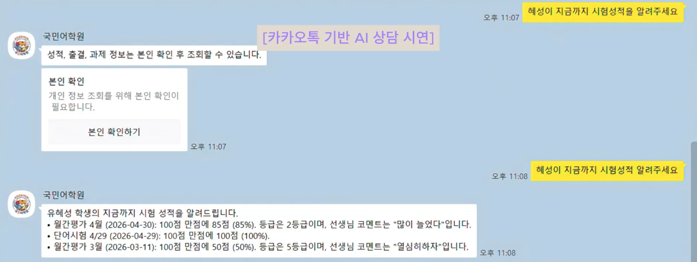
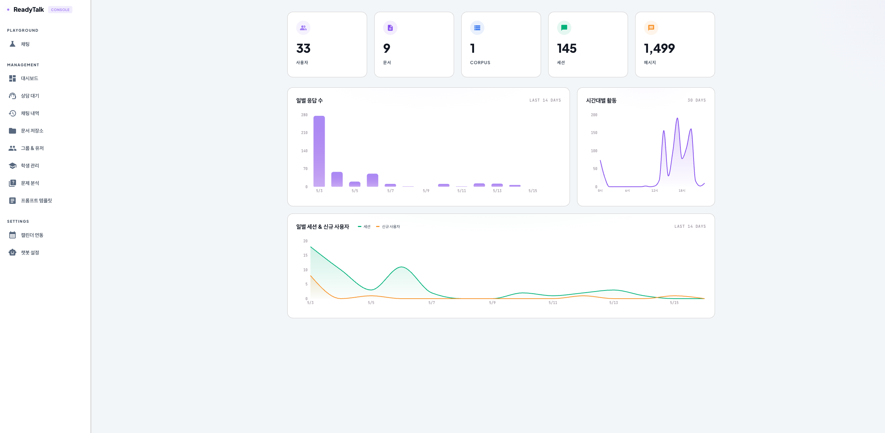
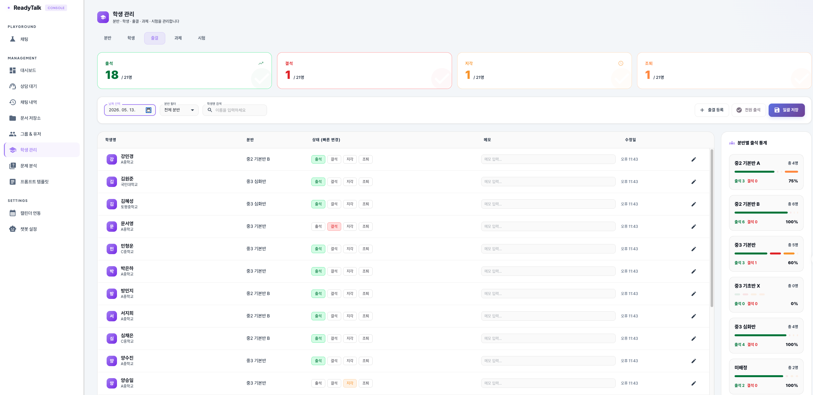
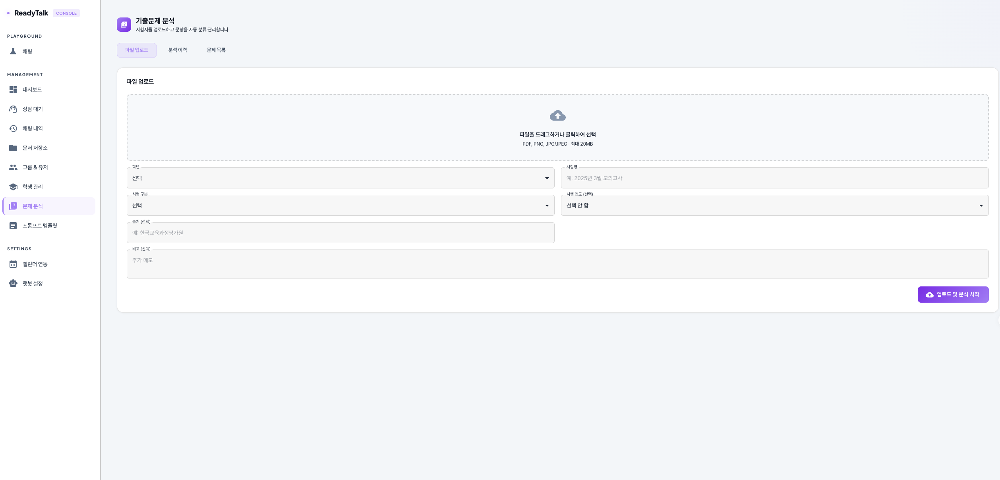
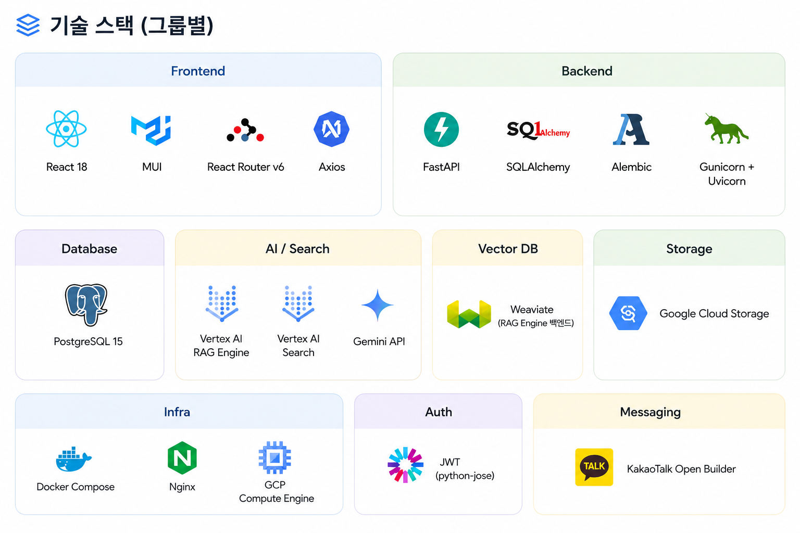
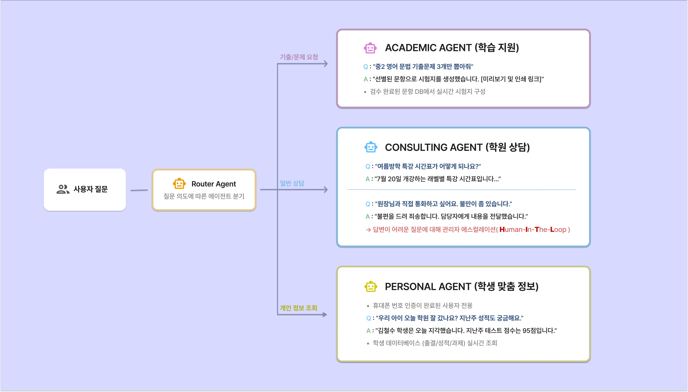
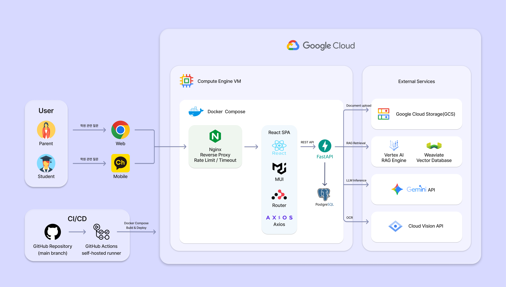

  

  <b>중소형 학원의 반복 운영 업무를 줄여주는 AI 기반 챗봇 서비스</b>

---

## 📚 목차

- [1. 프로젝트 소개](#1-프로젝트-소개)
  - [프로젝트 개요](#프로젝트-개요)
  - [프로젝트 차별점 및 핵심 기능](#프로젝트-차별점-및-핵심-기능)
  - [주요 서비스 화면](#주요-서비스-화면)
- [2. 소개 영상](#2-소개-영상)
- [3. 팀 소개](#3-팀-소개)
- [4. 기술 스택](#4-기술-스택)
- [5. 시스템 아키텍처 및 AI 아키텍처](#5-시스템-아키텍처-및-ai-아키텍처)
---

# 1. 프로젝트 소개

## 프로젝트 개요

**ReadyTalk for Academy**는 AI 챗봇 기능을 기반으로한 멀티테넌트 학원 운영 플랫폼입니다.

잠재 고객에게는 상담 매뉴얼 기반 안내를 제공하고, 재원생과 학부모에게는 출결, 시험 정보 조회 등 개인화된 안내를 제공합니다.

또한 학원 운영자는 재원생의 출격, 과제, 성적과 같은 학업 정보를 직접 관리할 수 있고 AI 기반 기출문제 유형 분류를 통해 수작업으로 처리하던 업무를 효율화 할 수 있습니다.

## 프로젝트 차별점 및 핵심 기능

| 기능                       | 설명                                                     |
| -------------------------- | -------------------------------------------------------- |
| AI 상담 (잠재 고객)        | 학원 매뉴얼 문서 기반 검색 및 응답 제공                  |
| AI 상담( 재원생 및 학부모) | 학업 데이터(출결, 과제, 성적) 기반 상담 및 안내 제공     |
| KakaoTalk 연동             | 카카오톡 채널 기반 상담 제공                             |
| 학생 관리 (관리자)         | 학원 운영을 위한 학생 정보 및 성적, 출결, 과제 등을 관리 |
| 문제 유형 분류 (관리자)    | 기출 문제 유형 자동 분류 및 사용자 요청 시 제공          |

## 주요 서비스 화면

**카카오톡 기반 상담**

**관리자 페이지**

**학생 관리 페이지**

**문제 분석 페이지**

---

# 2. 소개 영상

<iframe width="560" height="315" 
  src="https://www.youtube.com/embed/qUztXEeM9q8" 
  title="YouTube video player" 
  frameborder="0" 
  allow="accelerometer; autoplay; clipboard-write; encrypted-media; gyroscope; picture-in-picture" 
  allowfullscreen>
</iframe>

---

# 3. 팀 소개

<table>
  <tr>
    <td align="center">
      <a href="https://github.com/yangjiwoong1">
         
        <b>양지웅</b>
      </a> 
      팀장 · 백엔드
    </td>
    <td align="center">
      <a href="https://github.com/ume24">
         
        <b>정유미</b>
      </a> 
      AI Agent 개발 프론트엔드
    </td>
    <td align="center">
      <a href="https://github.com/yunseo1011">
         
        <b>이윤서</b>
      </a> 
      AI Agent 개발
    </td>
    <td align="center">
      <a href="https://github.com/seungil0909">
         
        <b>양승일</b>
      </a> 
      문서 정리 개발 보조
    </td>
    <td align="center">
      <a href="https://github.com/hyeforest7">
         
        <b>유혜성</b>
      </a> 
      AI Agent QA
    </td>
  </tr>
</table>

---

# 4. 기술 스택

  

---

# 5. 시스템 아키텍처 및 AI 아키텍처

